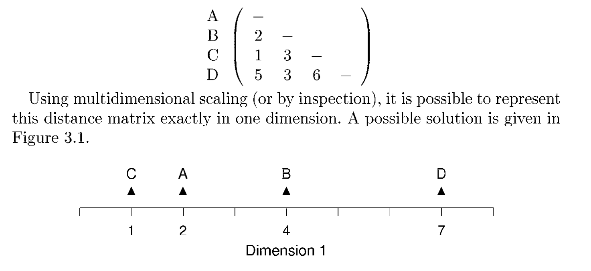
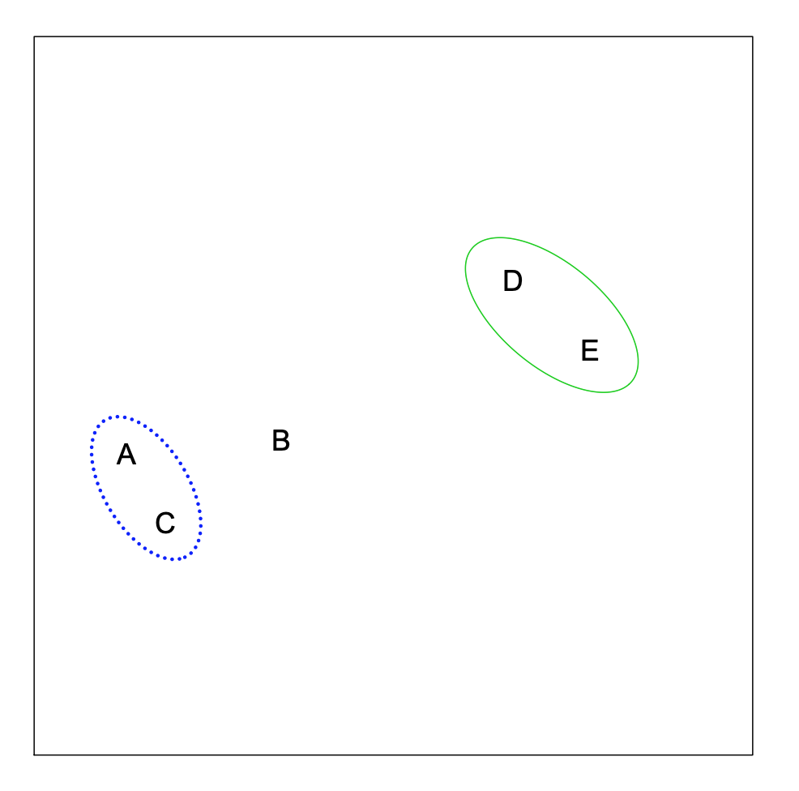

## Outline

Unsupervised analysis

Statistical analysis without any knowledge for the labeling of samples

The main aim is to find subgroups

- Dimension reduction
    + Principle component analysis (PCA)
    + Multiple dimensional scaling (MDS)
- Clustering
    + hierarchical clustering
    + partitioning (k-means)
    + model-based clustering
    + density-based clustering
    + consensus clustering

## Dimension reduction

Typically an expression matrix with n genes and m samples (n rows, m columns).
If the aim is to analysis samples, for statistical analysis, the matrix is a
data of **n dimensions**.

when n = 2, each sample can be represented as a data point in x-y coordinate 
system (2-dimensional coordinate system)

when n = 3, each sample is a point in a x-y-z coordinate system (3-dimensional).

when n > 3, each sample is a point in a high-dimensional coordinate system that
we can not visualize.

Dimension reduction is an approach to reduce the data from n dimensions to 2
dimensions, which still tries to keep the major patterns of it.

__In the sense of programming, the dimension of the matrix is two.__

## Principle component analysis

PCA is the most commonly used dimension reduction method.

Assumption when you use PCA:

- variance is a measurement of the information of the data

What does the PCA do:

- It actually rotates the original n-dimension coordinate system to a new one
where the data projected on the 1st axis shows highest variance.

The new axes are called the principle components.


---

Coordinate system rotation for a 2D dataset:


In PC1, the projected data points show highest variance.

M1 -> M2, where var(M2[, 1]) > var(M2[, 2])

---

Coordinate system rotation for a 3D dataset:


M1 -> M2, where var(M2[, 1]) > var(M2[, 2]) > var(M2[, 3])

---

Coordinate system rotation for a n-dimensional dataset:

M1 -> M2, where var(M2[, 1]) > var(M2[, 2]) > var(M2[, 3]) > ... > var(M2[, n])

(actually the dimension of M2 is always the min(nrow(mat), ncol(mat)))

And we use M2[, 1:2] or M2[, 1:3] to represent the original M1.

---

The contribution of each principle componet:

$p_i = var_i/\sum_i^K(var_i)$


----

Things need to be noted for PCA analysis

- it does not detect subgroups
- we normally give points different colors/shapes according to known annotations.

 

---

R functions to perform PCA analysis:

```
fit = prcomp(t(mat))  # why do we need to transpose the matrix?
loc = fit$x[, 1:2]  # the first two PCs
plot(loc)
```

To calculate the contribution of variance for each PC:

```
all_var = apply(fit$x, 2, var)
all_var/sum(all_var)
```

## Multiple dimensional scaling

MDS also reduces the dimension of the data, but it works on the distance matrix (similarity matrix).

It tries to preserve the distance between data points also in low-dimension space.

## what is a distance matrix

Values in the distance matrix measures the "distance" or "similarity" between every two samples.

- Euclidean distance
- correlation distance (1 - cor, 1 - abs(cor))

check the documentation of "dist()" function

## Multiple dimensional scaling

In the distance matrix, $d_{ij}$ is the distance between i and j in the n-dimension space

If we reduce into 2D, x and y, MDS aims to find a solution so that

$dist( <x_i, y_i>, <x_j, y_j> ) \approx  d_{ij}$

M1 -> M_xy



---

R functions to perform MDS analysis:

```
loc = cmdscale(dist(t(mat)), k = 2)
plot(loc)
```


## Compare PCA and MDS

- PCA is used more than MDS because PCA tells you the contribution of PC1 and PC2
- MDS directly works on the distance matrix, which means you can use any type of 
distance measurements
- PCA and MDS is identical if Euclidean distance is used for MDS.
    + PCA is a special case of MDS

## Clustering

- hierarchical clustering
- partitioning (k-means)
- model-based clustering
- density-based clustering
- consensus clustering


## Hierarchical clustering

It looks for the hierarchy of the similarity of samples.

First we find two data points that are closest.


---

A and C are merged as a unit and we look for which two
data points are closest in the "four" data points.


---

And we repeat this process ..,



---

...


---

untile all the data points are included in the hierarchy.


---

We can make this process as a tree (the dendrogram) where
the height are the distance between two "data points".


---

how to calculate distance of two clusters


clustering method (linkage method):

- complete: max(d_AD, d_AE, d_CD, d_CE)
- single: min(d_AD, d_AE, d_CD, d_CE)
- average: mean(d_AD, d_AE, d_CD, d_CE)

---

Be careful different clustering methods give different dendrograms:


---

The dendrogram can be cut into k sub-clusters to separate samples
into k groups (cutree).


```
hc = hclust(dist(t(mat)))
plot(hc)
```

## k-means clustering

Put n data points into k groups, so that the within-cluster sum of squares (WCSS) is minimal:

$\displaystyle {\underset {\mathbf {S} }{\operatorname {arg\,min} }}\sum _{i=1}^{k}\sum _{\mathbf {x} \in S_{i}}\left\|\mathbf {x} -{\boldsymbol {\mu }}_{i}\right\|^{2}$


---

Basic steps:

1. decide k groups and random initialize k centers.
2. for each data point, calculate the distance to the k centers can label the
cluster id to the nearest center.
3. since all data points are labelled with the k clusters, re-calculate the position of centers
4. repeat step 2 and 3, untile the labels not change

```
km = kmeans(t(mat), centers = 2)
km$cluster
```

---


---


---

how to select the number of clusters?

We can look at the sum of squared error for each k:

$SSE = \sum_{i=1}^K\sum_{x \in c_i}dist(x, c_i)^2$

where $c_i$ is the center of each cluster.


--- 

Some drakbacks for k-means clustering

k-means works best if the cluster is spherical


## model-based clustering

Try to fit the data with k multidimensional normal distribution.


## density-based clustering


---

For DBSCAN, you need to set the maximal distance to neighbourign points
and the minimal number of neighbouring points.


---


## Consensus clustering

It checks the stability of the subgrouping.

Assume we have four subgrouping results by random sampling from the
original data.

```
1 1 1 1 1 1 1   1 2 2 2    2 2
1 1 1 1 1 1 2   1 2 2 2    2 2
1 1 1 1 1 1 2   1 2 2 1    2 1
1 1 1 1 1 1 1   1 2 2 2    2 1
```

```
1 1 1 1 1 1 0.5 1 0 0 0.25 0 0.5  # belong to group 1
0 0 0 0 0 0 0.5 0 1 1 0.75 1 0.5  # belong to group 2
            ~~~              ~~~
```

consensus subgroup

```
1 1 1 1 1 1 ?   1 2 2  2   2 ?
```


